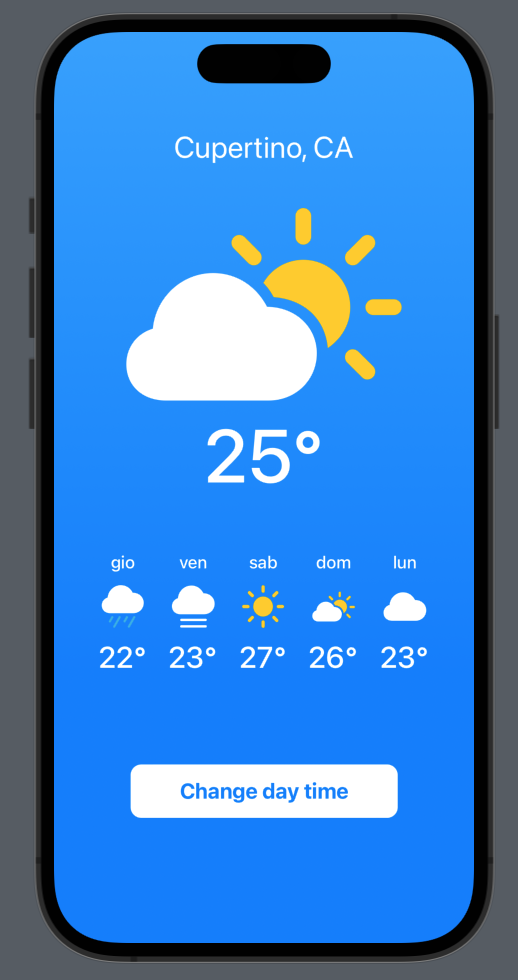
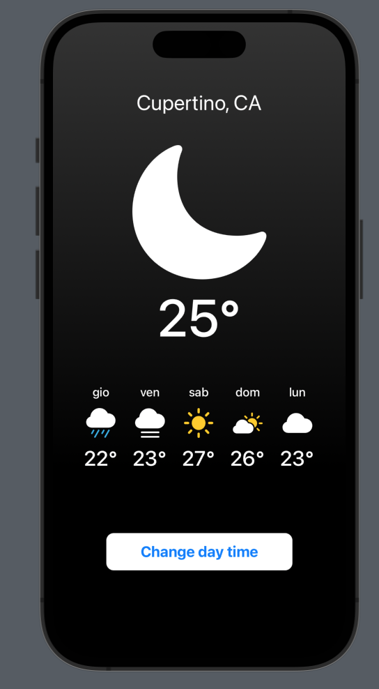

# Wheather

## Introduction
This is my first SwiftUI project. Here I'm learning to develope the UI of an Apple Universal App.

The project consists in developing the UI of the main page of a wheather app.

I'm studying SwiftUI thanks to this [video](https://youtu.be/b1oC7sLIgpI?si=rbQqJavLBTJpxdya)

## Preview
 
